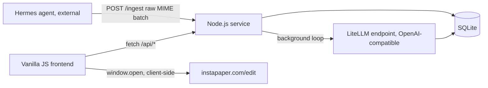

# Newsletter Digest — Design + Implementation Plan

## Context

The user receives a high volume of newsletters and wants a single triage view: forward
newsletters to a mailbox, have links extracted/deduped/categorized/summarized, and act on
each link (save to Instapaper, or dismiss). The repo currently contains only a frontend
mockup (`NewsletterDigest.dc.html` + `newsletter-data.js` + the vendored `nocturne` design
system) built with a proprietary preview/prototyping runtime (`support.js`) — there is no
backend, and that runtime is not meant to power a real app. Everything below is greenfield.

Key constraint discovered during brainstorming: email retrieval is **not** this service's
job. A separate homelab agent ("Hermes") already retrieves email from Migadu. This service
must expose a pluggable **ingestion port** that Hermes calls; retrieval logic must never be
built into or coupled to this service, so a different retriever could be swapped in later
without touching parsing/storage/UI.

## Architecture



Single Node.js process, runs on the homelab, reachable only over Tailscale (no app-level
auth — the VPN is the access boundary). Three logical parts in one process:

1. **Ingestion port** — `POST /ingest`. Pluggable by contract: any caller that POSTs raw
   MIME emails works, so retrieval mechanism can change without touching the rest.
2. **Enrichment worker** — background poll loop, calls an **LLM provider port**: an
   OpenAI-compatible client configured via env vars (base URL, API key, model names) so it
   points at the user's LiteLLM endpoint, but isn't hardcoded to a specific provider.
3. **Web layer** — serves the reimplemented static frontend + a small JSON API.

## Data model (SQLite)

```sql
CREATE TABLE emails (
  id            INTEGER PRIMARY KEY,
  message_id    TEXT UNIQUE NOT NULL,   -- Message-ID header, or SHA-256(from+subject+body) fallback
  from_address  TEXT,
  from_name     TEXT,                  -- becomes "source" on cards
  subject       TEXT,
  raw_mime      TEXT,                  -- kept for reprocessing/debugging
  received_at   DATETIME,
  processed_at  DATETIME              -- NULL until heuristic extraction runs
);

CREATE TABLE links (
  id              INTEGER PRIMARY KEY,
  url_normalized  TEXT UNIQUE NOT NULL, -- dedup key: tracking params/fragment/trailing slash stripped
  url_original    TEXT NOT NULL,        -- first-seen URL, used as the outbound link
  headline        TEXT,
  summary         TEXT,                 -- NULL until enrichment; may be LLM-synthesized from multiple sources
  read_time       INTEGER,              -- minutes, from enrichment
  enriched_at     DATETIME,             -- NULL = pending enrichment; sentinel value = gave up after max retries
  enrich_attempts INTEGER DEFAULT 0,
  read            BOOLEAN DEFAULT 0,
  dismissed       BOOLEAN DEFAULT 0,    -- permanent: dismissing hides the URL forever, even if re-mentioned later
  saved_instapaper BOOLEAN DEFAULT 0
);

CREATE TABLE link_sources (         -- one link can come from many emails
  link_id            INTEGER REFERENCES links(id),
  email_id           INTEGER REFERENCES emails(id),
  extracted_summary  TEXT,          -- heuristic-extracted blurb near the link in that email, if any
  UNIQUE(link_id, email_id)
);

CREATE TABLE link_topics (          -- many-to-many: a link can span multiple topics
  link_id  INTEGER REFERENCES links(id),
  topic    TEXT,
  UNIQUE(link_id, topic)
);
```

## Ingestion flow

`POST /ingest` body: `{ emails: [{ raw_mime: "<MIME text or base64>" }, ...] }`

Per email, independently (one email's failure doesn't abort the batch):
1. Parse MIME (`mailparser`) → headers + HTML/text body.
2. Dedup key: `Message-ID` header, falling back to `SHA-256(from+subject+body)`.
3. `INSERT OR IGNORE` into `emails` on `message_id`; if it already existed, report `duplicate`.
4. Extract links from HTML (`cheerio`): normalize each URL, capture nearby text as a candidate
   `extracted_summary`.
5. `INSERT OR IGNORE` into `links` on `url_normalized`; insert into `link_sources`.
6. Set `emails.processed_at`.

Response: `{ results: [{ message_id, status: "ingested"|"duplicate"|"error", error? }, ...] }`,
one entry per input email.

## Enrichment flow

Background loop (e.g. `setInterval`, ~30s) in the same process:
1. Select links where `enriched_at IS NULL` and ≥1 source has `processed_at` set.
2. Bounded concurrency (e.g. 3 at a time). Build one LLM call per link from: headline + all
   sources' `extracted_summary` (if any) + source names → expect structured JSON back:
   `{ summary, topics: [...], read_time }`.
   - If sources have extracted summaries, the LLM synthesizes one final summary from them
     (grounded in real text) rather than inventing one from scratch.
   - Topic classification always goes through the LLM (can return multiple topics).
3. On success: write `summary`/`read_time`/`enriched_at` to `links`; upsert `link_topics` rows.
4. On failure: increment `enrich_attempts`, retry next tick; after 5 failures, set `enriched_at`
   to a sentinel (stop retrying) — link shows as "Uncategorized" in the UI.

## API + save action

- `GET /api/links?search=&group=source|topic|type&hideRead=true|false`
- `POST /api/links/:id/dismiss`, `POST /api/links/:id/read` (toggle) — plus bulk variants
  taking `{ids: [...]}` for the multi-select bar.
- `POST /api/links/:id/mark-saved` — flips `saved_instapaper` for UI state only.
- **No server-side Instapaper call.** Save is fully client-side: a configurable URL template
  (e.g. `https://www.instapaper.com/edit?url={url}&title={title}`, served via a small
  `/api/config` endpoint or a frontend config constant) is filled in and opened with
  `window.open`; Instapaper's own site handles auth via the browser's existing session
  cookie. No credentials stored anywhere in this service.
- No app-level auth on any endpoint — Tailscale is the access boundary.

## Frontend

Reimplement `NewsletterDigest.dc.html` as plain HTML using the same markup structure and
`nocturne` design-system classes, but replace the `{{ }}`/`sc-for`/`sc-if` bindings with a
small vanilla JS file that fetches `/api/links` and renders cards directly into the DOM.
Wire dismiss/read/save/bulk actions to the API above. Headline links already `target="_blank"`
— no separate "open" action needed. The Obsidian button is dropped entirely (clicking the
headline is sufficient; the user clips manually).

## Repo layout (new)

```
server/
  index.js            -- entrypoint: starts web server + enrichment loop
  db.js                -- SQLite setup/migrations (schema above)
  ingest.js             -- POST /ingest handler: MIME parse, dedup, link extraction
  enrich.js             -- background enrichment loop + LLM client
  api.js                -- /api/links, dismiss/read/mark-saved routes
  config.js             -- env-driven config (LLM base URL/key/models, Instapaper URL template)
public/
  index.html            -- reimplemented frontend (was NewsletterDigest.dc.html)
  app.js                 -- vanilla JS: fetch, render, action wiring
  nocturne/               -- existing design system, reused as-is
data/
  digest.sqlite          -- SQLite file (gitignored)
```

## Implementation phases

Each phase is atomic: self-contained inputs/outputs, a failing test written first, and
independently verifiable/rollback-able (revert the phase's commit).

**Phase 1 — DB schema + migrations — ✅ DONE**
- Input: schema above. Output: `server/db.js`, migration applied to a fresh `data/digest.sqlite`.
- Test first: a test that opens the DB, runs migrations, asserts all tables/columns exist.
- Rollback: delete `data/digest.sqlite`, revert commit.
- Summary: `server/db.js` exports `openDb(dbPath)` — idempotent, creates parent dir, opens
  better-sqlite3 with WAL + `foreign_keys=ON`, runs the schema above (`link_sources`/
  `link_topics` FK columns tightened to `NOT NULL`, a deviation from this doc's SQL — see
  AGENTS.md). 10 tests in `server/db.test.js` cover table/column shape, UNIQUE/NOT NULL/FK
  enforcement, WAL mode actually being active, and data surviving a close/reopen cycle.
  Adversarial review pass done; all HIGH/MEDIUM findings resolved except the "no ON DELETE
  behavior" one, deferred as a documented future concern (nothing deletes rows yet).

**Phase 2 — Ingestion endpoint (MIME parse → dedupe → link extraction) — ✅ DONE**
- Input: Phase 1's DB. Output: `server/ingest.js`, `POST /ingest` wired into `server/index.js`.
- Test first: fixture raw MIME emails (including a duplicate `Message-ID` and two emails
  sharing a URL) → assert `emails`/`links`/`link_sources` rows match expectations, response
  shape matches `{results: [...]}`.
- Rollback: revert commit; DB schema unaffected (additive).
- Summary: `server/ingest.js` exports `ingestEmails(db, emails)` (MIME parse via mailparser,
  dedupe via `Message-ID` falling back to `SHA-256(from+subject+body)`, link extraction via
  cheerio filtered to http/https hrefs, URL normalization stripping tracking params/fragment/
  trailing slash) and `normalizeUrl`. `server/index.js` wires `POST /ingest` (Express) plus
  error-handling middleware for malformed-JSON and unexpected errors; `server/config.js` holds
  `DB_PATH`/`PORT` env config (to be extended with LLM config in Phase 3). 23 tests across
  `ingest.test.js`/`index.test.js` cover the dedupe/merge/error-isolation/base64 cases plus
  hardening from the adversarial review pass (mbox-line misdetection, whole-email-transaction
  atomicity on partial failure, malformed-JSON handling). All HIGH/MEDIUM review findings fixed.

**Phase 3 — Enrichment worker (LLM provider port) — ✅ DONE**
- Input: Phase 2's `links` rows. Output: `server/enrich.js`, `server/config.js` (env-driven
  OpenAI-compatible client pointed at LiteLLM).
- Test first: mock LLM client, assert single-source-with-summary path skips synthesis,
  multi-source path sends all extracted summaries, failure path increments `enrich_attempts`
  and sentinel-stops after 5.
- Rollback: revert commit; enrichment is additive/idempotent (safe to disable the loop).
- Summary: `server/enrich.js` exports `runEnrichmentPass(db, {client, model, concurrency,
  maxAttempts})` (selects links with ≥1 processed source and `enriched_at IS NULL`, bounded
  worker-pool concurrency, one LLM call per link built from headline + source names +
  extracted summaries with different prompt wording for zero/one/many-source cases) and
  `startEnrichmentLoop` (setInterval wrapper with an overlap guard). `server/config.js` gained
  `LLM_BASE_URL`/`LLM_API_KEY`/`LLM_MODEL`/`ENRICHMENT_*` env vars (clamped to sane minimums).
  `server/index.js` wires a real `openai`-package client against the configured endpoint, or
  disables the loop with a warning if unconfigured. 36 tests total (12 new in
  `enrich.test.js`) cover the prompt-shape branching, retry/sentinel behavior, bounded
  concurrency, and — after the adversarial review pass — an in-process double-processing
  guard, topic normalization, and config clamping. All HIGH/MEDIUM review findings fixed.
  **Gotcha for Phase 4:** `enriched_at` is tri-state (NULL/date/`'gave_up'` sentinel) — see
  AGENTS.md.

**Phase 4 — Read API (`GET /api/links` with search/group/hideRead) — ✅ DONE**
- Input: enriched `links` table. Output: `server/api.js` read routes.
- Test first: seed DB with mixed read/dismissed/topic data, assert filter/group/search
  behavior against expected JSON.
- Rollback: revert commit.
- Summary: `server/api.js` exports `getLinks(db, {search, group, hideRead})` (always excludes
  dismissed links; `group` is `source` or `topic` — links appear in every matching group
  rather than being collapsed to one, per the "don't collapse multi-source/multi-topic"
  decision; topic-less links land in a synthetic "Uncategorized" group) and
  `createReadRoutes(db)`, mounted in `server/index.js` as `GET /api/links`. **`group=type` is
  intentionally unsupported** (400) — the design doc mentioned it but no `type` classification
  was ever built in Phases 1–3; deferred as a future improvement, not silently faked. 49 tests
  total (12 new in `api.test.js`) cover filtering/grouping/search plus, after the adversarial
  review pass, `hideRead` truthy-string parsing edge cases, literal `%`/`_` in search terms,
  and case-insensitive `group` values. All HIGH/MEDIUM review findings fixed (no SQL injection
  found — parameters are properly bound throughout).

**Phase 5 — Action API (dismiss/read/mark-saved, bulk variants)**
- Input: Phase 4's API. Output: additional routes in `server/api.js`.
- Test first: assert dismiss is permanent (re-ingesting the same URL doesn't undo it),
  bulk endpoints apply to all given ids.
- Rollback: revert commit.

**Phase 6 — Frontend reimplementation**
- Input: Phases 4–5's API. Output: `public/index.html`, `public/app.js`, config-driven
  Instapaper URL template.
- Test first: none meaningful to automate beyond a smoke check; manually verify in a
  browser (search, group toggle, hide-read, dismiss, save opens Instapaper edit URL,
  bulk bar) per the "run" skill.
- Rollback: revert commit; `NewsletterDigest.dc.html` mockup stays untouched as reference
  until this phase is confirmed working, then can be deleted.

## Verification (end-to-end)

1. Run the server locally; POST a small batch of fixture `.eml` files to `/ingest`, confirm
   `emails`/`links` populate as expected (including a duplicate-URL case merging into one
   card with two sources).
2. Let the enrichment loop run (or trigger it manually in a test harness), confirm
   `summary`/`topics`/`read_time` populate.
3. Open the frontend over Tailscale, confirm search/group/hide-read/dismiss/read/save
   all work against the real API, and that a dismissed link never reappears even if the
   same URL is re-ingested from a new fixture email.
4. Flag: the Instapaper `edit?url=&title=` URL mechanism is **not yet verified against the
   live Instapaper site** — first smoke-test in Phase 6 before considering it done.

## Next-phase prompt (for Phase 1, to hand to a clean session)

> Implement Phase 1 of the newsletter-digest plan (see
> `docs/plan/2026-07-25-newsletter-digest-design.md` for full context). Build
> `server/db.js` in the newsletter-digest repo: a SQLite setup module using the schema in
> the "Data model" section of that plan (emails, links, link_sources, link_topics tables).
> Use `better-sqlite3` (synchronous, single-process-safe). Write a failing test first
> (e.g. `server/db.test.js`) that opens a fresh DB, runs the migration, and asserts every
> table and column from the schema exists, before writing the migration itself. No other
> phases' code should be touched.
